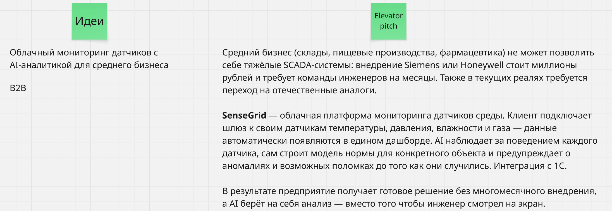
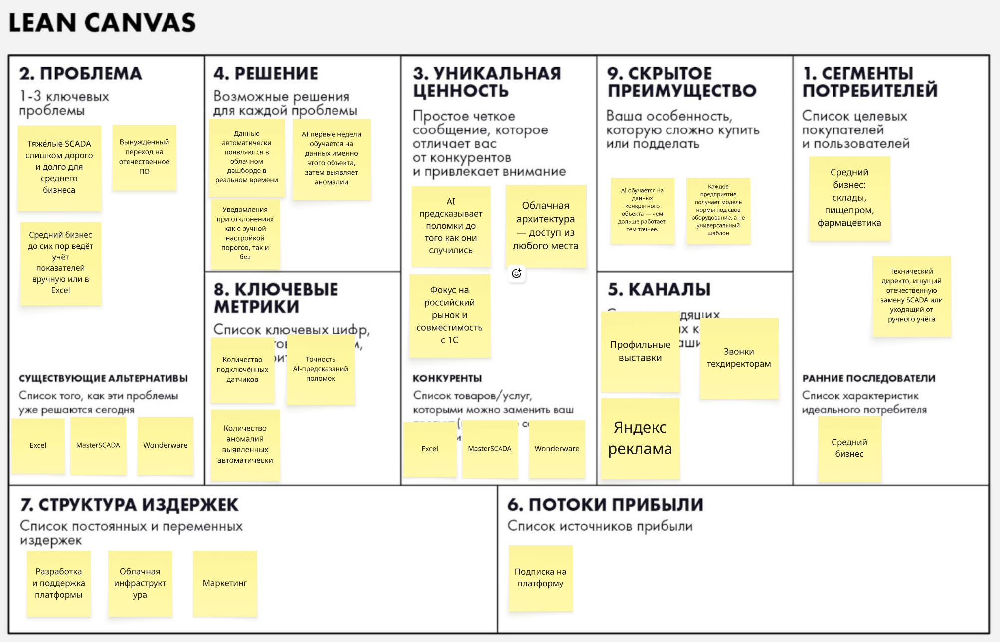

# Облачный мониторинг датчиков с AI-аналитикой для среднего бизнеса

## Elevator Pitch

Средний бизнес (склады, пищевые производства, фармацевтика) не может позволить себе тяжёлые SCADA-системы: внедрение Siemens или Honeywell стоит дорого и требует команды инженеров на месяцы. Также в текущих реалях требуется переход на отечественные аналоги.

**SenseGrid** — облачная платформа мониторинга датчиков среды. Клиент подключает шлюз к своим датчикам температуры, давления, влажности и газа — данные автоматически появляются в едином дашборде. AI наблюдает за поведением каждого датчика, сам строит модель нормы для конкретного объекта и предупреждает о аномалиях и возможных поломках до того как они случились. Интеграция с 1С.

В результате предприятие получает готовое решение без многомесячного внедрения, а AI берёт на себя анализ — вместо того чтобы инженер смотрел на экран.

## lean-canvas

## Ссылки
[Открыть в Miro](https://miro.com/app/board/uXjVGo9vs0E=/)